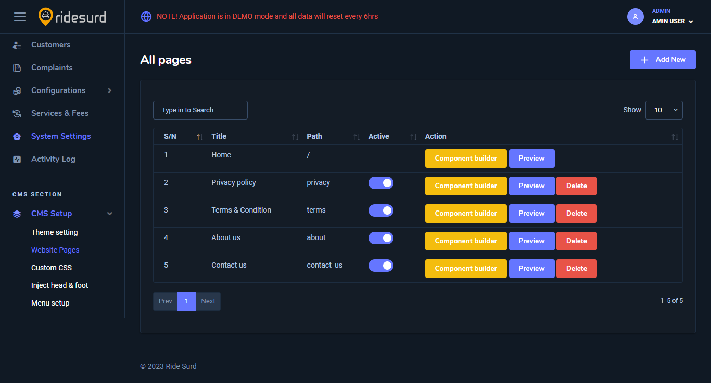

# Admin App

### Introduction

Ride Surd is a comprehensive ride-hailing system that offers various transportation and ride-sharing services. Ride Surd ensures that clients have access to essential services like transportation, vehicle booking for various needs, customizable booking options, and detailed booking information. Our application is designed to accommodate multiple currencies and time zones, allowing you to launch it globally. Additionally, Surd Taxi supports multiple languages, and you can easily customize the localization content through the translation feature in our admin app.

### Major Admin Modules are

1. Dashboard&#x20;
2. Admins&#x20;
3. Regions&#x20;
4. Trips&#x20;
5. Drivers&#x20;
6. Customers&#x20;
7. Companies&#x20;
8. Complaints&#x20;
9. Configurations&#x20;
10. Services & Fees&#x20;
11. System Settings&#x20;
12. CMS SECTION > CMS Setup

**1. Dashboard**

The dashboard serves as your control center, offering insights into key metrics and activities such as car bookings, trip requests, customers, drivers, complaints, and recent activities.

<figure><figcaption></figcaption></figure>

_Dashboard Theme_ - You can toggle between Light and Dark mode on your dashboard. Simply click on your Profile at the top-right corner and change to the theme you want.

<figure><figcaption></figcaption></figure>

**2. Admins**

Manage platform administrators by viewing existing profiles and adding new ones.

<figure><figcaption></figcaption></figure>

To add a new Admin, Click the `+ Add New` button, fill all the necessary details and click the `Save` button.

<figure><figcaption></figcaption></figure>

**3. Regions**

Define service areas, set restrictions, and configure region details including name, time zone, currency, and country.

<figure><figcaption></figcaption></figure>

To add new region, click the `+ Add New Area` Button, fill the necessary details, select a location and click `Save Record`  or  `Rest` to reset it.

<figure><figcaption></figcaption></figure>

**4. Trips**

Track and manage all trips, including _pending_, _completed_, _scheduled_, and _canceled_ trips. Basically, all these pages have the same UI and features. Access trip details like, Service Area, Reference, Ride type, Date, Rider Name, Driver Name, Trip Status, Grand Total. From the sorting menu, you can also filter by completed, pending or scheduled.

<figure><figcaption></figcaption></figure>

With the Export option, you can choose to export your data to the available format.

**5. Drivers**

Efficiently manage drivers by viewing active profiles, adding new drivers, approving documents, and monitoring driver activities.

<figure><figcaption></figcaption></figure>

To add New driver, Go to the Active submenu, then click the `+ Add New Driver` button and fill all the necessary details and click `Save`

<figure><figcaption></figcaption></figure>

After adding a new driver, you can see the a list of them and notice there this icon  .png>) When you click this icon, it shows you the drivers documents and details.&#x20;

Under the action menu, you can choose to edit/update or view the driver's document details.

**6. Customers**

Access a list of all customers. Here, you can create, edit or delete a customer. You can also see their approval status.

<figure><figcaption></figcaption></figure>

You can choose to export all the available customers to the available file format

**7. Companies**

Manage companies, relevant when fleet management is enabled. Add new companies, manage company details, and define permissions for company admins.

<figure><figcaption></figcaption></figure>

**8. Complaints**

Here you can see the complaints list that is raised by the users & drivers from the platform. And you can configure the complaints titles at which category they want to raise their complaints.&#x20;

<figure><figcaption></figcaption></figure>

\
You can also raise complaints by clicking the `+ Add New` button

**8. Configurations**

Under Configuration we have the following

* Features activation
* User roles
* Vehicle types
* Vehicle makes
* Vehicle models
* Countries
* Documents
* Cancellation Reasons
* Faqs

**Feature Activation** - Here we have General settings and and SMS methods. You can control the settings in each section by toggling the settings under them such as Enable Instant Ride, Enable Fleet, Map Home Screen, Enable Email Verification, Enable SMS Verification, Enable Https, Enable Frontpage, Enable Mobile Slider, Enable Mobile Car Listing, Enable Sendchamp.

<figure><figcaption></figcaption></figure>

**User Roles** - Here, you can manage roles like Driver, Owner, Rider, Manager Admin etc.&#x20;

<figure><figcaption></figcaption></figure>

**Currencies** - Here, you can manage all currencies. You can add, delete or export available currencies as well.

<figure><figcaption></figcaption></figure>

**Vehicle Type** - Here, you can manage all the vehicle types. To add new vehicle type listing, click the `+ Add New` and fill the details, upload the vehicle image and click `Save`

<figure><figcaption></figcaption></figure>

You can click the `edit` but to edit the listing. You can also toggle  between the status.

**Vehicle Make** - Here, you can manage the Vehicle makes.

<figure><figcaption></figcaption></figure>

**Vehicle Models** - Here, you can manage the Vehicle Models.

<figure><figcaption></figcaption></figure>

**Countries** - Here, you can manage all the countries. Toggle between the status and also edit them.

<figure><figcaption></figcaption></figure>

**Document** - Here, you can add or edit Documents. You can also export them using the export option. You can turn ON or OFF between document that Is Required or Expired.

<figure><figcaption></figcaption></figure>

**Cancelation Reasons**  - Here, you will find all the cancelation reasons. You can add new reasons, edit existing ones or export all the cancelation reasons.

<figure><figcaption></figcaption></figure>

**FAQs** - Here, you can manage all the Frequently Asked Questions (FAQs). You can create new FAQs by clicking the `+ Add New` button. You can also edit or delete the existing ones by clicking the `edit` or `delete` button under each FAQ respectively

<figure><figcaption></figcaption></figure>

**17. Services & Fees**

Define service types, fees, and associated details. Here, you can manage and set up all the services and fees.

<figure><figcaption></figcaption></figure>

To set up new one, click the `+ Add New` button, select a service region, and fill the rest of the fields and click `Save.` You can also toggle ON or OFF between the services and also edit them by clicking the three dots beside them.

<figure><figcaption></figcaption></figure>

**9. System Settings**

In the system settings, you can configure the following settings:

<figure><figcaption></figcaption></figure>

* General settings
* Mobile app settings
* SMTP settings
* OTP provider settings
* Firebase settings
* Payment methods
* License&#x20;
* Trip Settings
* Activitiy Log

**General Settings** - Here, you can edit your site name, site slogan, update the logo, your default country and currency, contact email and phone etc. click the "Update" button once you are done.

<figure><figcaption></figcaption></figure>

**SMTP settings** - Here, you can configure the following `MAILER (smtp)`  `MAIL_HOST` `MAIL_PORT MAIL_USERNAME` `MAIL_PASSWORD`  `MAIL_ENCRYPTION` `MAIL_FROM_ADDRESS`  `MAIL_FROM_NAME`

<figure><figcaption></figcaption></figure>

**Mobile App Settings**- Here, you can set the following; OTP Provider, Site Name, Site Slogan, Contact Email, Contact Phone, Site Description, Terms & condition link, Privacy link, About us link, Change Password link, Contact Us link, Faqs link, In app logo etc.

Click the `Update` button once you are done.

<figure><figcaption></figcaption></figure>

**Firebase settings** - Here, you can do the following configurations;  `FIREBASE PROJECT ID`, `FIREBASE API KEY,`  setup your map config here, Setup sendchamp settings.&#x20;

<figure><figcaption></figcaption></figure>

Click the `Update` button once you are done.

**Payment methods** - Here, you can set up your Paystack, Flutterwave and PayPal.\

<figure><figcaption></figcaption></figure>

**License** - Here, you can set up your License keys, eg, your application key and also update your company or organization name. Once you are done, click the `Update` button to save changes

<figure><figcaption></figcaption></figure>

**Trip Settings** - Configure the trip settings here. You can configure the following; Allow drivers to set radius, Allow drivers to set service type, Allow booking when no drivers is online, Max No of Drivers to Notify, Max Distance to notify etc.

<figure><figcaption></figcaption></figure>

Click the `Update` button once you are done.

**Activity Log** - Here, all your activities will appear here. The date it was created, the title and the info.

<figure><figcaption></figcaption></figure>

**10. CMS Section - CMS Setup**

Set up the content management system (CMS) for your taxi admin, including adding website pages, customizing the frontend, and configuring CMS settings.

The CMS setup contains the following

* Theme setting
* Website Pages
* Custom CSS
* Inject head & foot
* Menu setup

**Theme Setting** - Here you can select another look of the  _Navbar_, configure the _Home Banner_ and Edit all the _Footer_ content on the go.

<figure><figcaption>
NavBar
</figcaption></figure>

<figure><figcaption>
Home Banner
</figcaption></figure>

<figure><figcaption>
Profile Setting
</figcaption></figure>

**Website Pages** - Here, you can manage the website pages.&#x20;

<figure><figcaption></figcaption></figure>

You can create new page by clicking the `+ Add New` button. Type in the page title and the page path and click `Save.`

<figure><figcaption></figcaption></figure>

You can also toggle between which page you want to be active or not. You can also choose to delete any of the pages by clicking the `Delete` Button or click the `Preview button`   to preview the page.

You can automatically create more page component by clicking the `Component Builder` button, then select the the page component you want to build and click `Add`. You can also click the `View Component`  to preview the page component.

<figure><figcaption></figcaption></figure>

To manually edit the page, you have to use the page builder. Click the `Page Builder` button at the top left corner to launch the page builder. This is a tool to help you create and design your page component.

**Custom CSS** - this is where you write or add all your custom css, then click the `Save` button when you are done.

<figure><figcaption></figcaption></figure>

**Inject head & foot** - Customize your head section and foot section

<figure><figcaption></figcaption></figure>

**Menu setup** - here, you can set up your menu. Start by creating a menu.

Click the `+Add New` button to create  your menu. Once you create a menu, you will be able to add menu items by clicking the `Add menu Item`. This will bring up a window where you will fill all the necessary things.

<figure><figcaption></figcaption></figure>

To delete or edit an already created menu, just click the `edit` or `delete` button at the top right of the menu.

This manual provides detailed instructions for each feature to optimize your taxi service administration.
