# Mobile App

### 1. Introduction

This project consists of 1 Mobile App, 1 Admin Portal clubbed Website.

Technologies Used in Web App are:

1. React.Js
2. Redux
3. Firebase Realtime Database
4. Firebase Firestore

We have built the Mobile App using React Native(Expo) for iOS and Android

The main Technologies used are

1. React Native
2. Expo
3. React Native Elements

### 2. Environment Setup

To run the 2 Apps you need following things in your development machine as mentioned below.

A. Download NodeJs

<figure><figcaption></figcaption></figure>

1.

    * Download instructions
    * Mac users: For OS X, download the .pkg file form below link.(v.16.18.0 recommended)
    * Windows users: Download either the MSI or the .exe form below link, whichever you prefer .(v.16.18.0 recommended)

    [Download Node v.16.18.0 from here](https://nodejs.org/dist/v16.18.0/)
2. After Installing NodeJs you'll most likely need to restart your computer.
3. To ensure that NodeJs is installed correctly, you can type:
4. `node -v`
5. NOTE: DO NOT IGNORE THE NODE JS VERSION. IT HAS TO BE 16.18.x

B. Install Git (Windows PC Only)

* Download and install the latest from this link. [https://git-scm.com/](https://git-scm.com/)\


D. Install Eas Cli\
.png>)

**In your command prompt, type:**

`npm install -g eas-cli`

**Create a account in** [**https://expo.io/signup**](https://expo.io/signup) **and use the same account to signin on command prompt using below command**

`eas login`

E. Install Yarn

**In your command prompt, type:**

`npm install -g yarn`

### 3. Project Configuration

Step 1 First Extract the Zip file downloaded from codecanyon.

Inside the Mobile.zip, there is 2 folder, "ride\_surd\_user" and "ride\_surd\_driver"

Repeat this setup for each&#x20;

Open the folder 'MobileApp' in Code Editor after extracting the Zip

Step 2 Duplicate the content of config-ex.json and rename as config.json

Change the following

app\_name, app\_slug, android\_app\_identifier, ios\_app\_identifier, googleApiKeys, google\_map\_api\_key, expo\_project\_id, codecanyon\_purchase\_code, base\_url, android\_store\_link  & apple\_store\_link in the config.json

**Note:** The app\_identifiers should be in lowercase only.

<figure><figcaption></figcaption></figure>

<figure><figcaption></figcaption></figure>

Step 3 Duplicate assets-ex and rename to assets, then update all default images to your branding assets, make sure all dimensions are sam


**Step 4** Go to [Firebase Console](https://console.firebase.google.com/u/0/) and then create a new project as shown in picture.


<figure>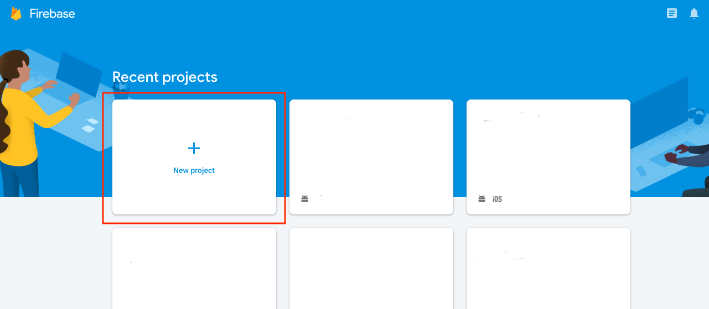<figcaption></figcaption></figure>

Type in your project name as shown in picture.

\


<figure>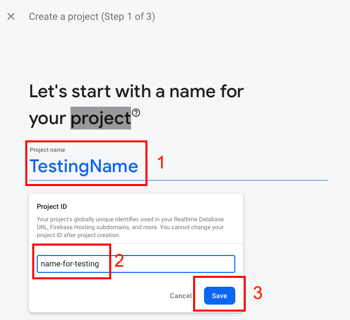<figcaption></figcaption></figure>

Accept terms and click on 'Create Project' as shown in picture.\


<figure>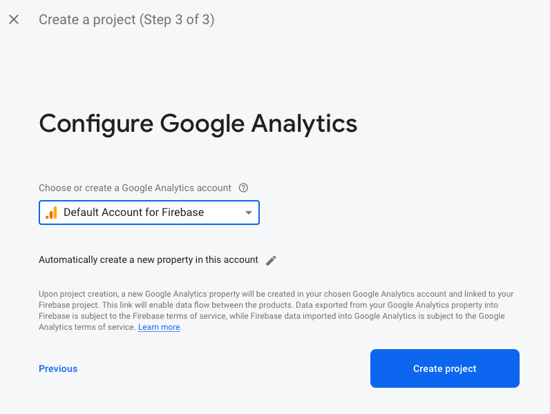<figcaption></figcaption></figure>

When your project is ready click the 'Continue' button as shown in picture.


<figure>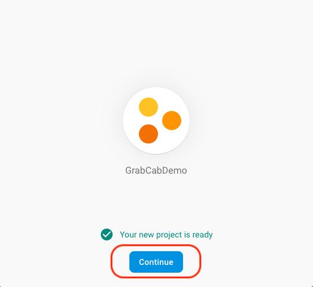<figcaption></figcaption></figure>

Create a new Realtime Database as shown in picture.

<figure><figcaption></figcaption></figure>

Start in test mode, copy rule and update

```

{
  "rules": {
    ".read": true,
    ".write": true
  }
}
```

Step 6 Change the Google map keys in the same file /config.json.

Replace XXXXXXXXXXXXXXX only. You can use same API key in 2 places or 2 different API keys for the 2 different platforms to better monitor platform wise usage and advance security.

Follow the Steps below to collect a valid Google API Key

Open [https://console.cloud.google.com/google/maps-apis/overview](https://console.cloud.google.com/google/maps-apis/overview)

<figure><figcaption></figcaption></figure>

Create a new project. Make sure the type of project is MAP PLATFORM type if asked and Billing will be dollar $ USD based. You will have to setup a Billing account if you do not have a dollar $ billing account. Then click on Create. Note: Firebase creates a project in Google cloud also. Avoid using the same for the Google Maps project.

<figure><figcaption></figcaption></figure>

Click on Menu Icon -> API & Services -> Credentials

<figure><figcaption></figcaption></figure>

Click on "Create Credential"

<figure><figcaption></figcaption></figure>

Click on "Create Credential" Copy the API key. This will be used in code.

<figure><figcaption></figcaption></figure>

Couple of more steps required from some extra permissions. Click on API & Services -> Dashboard -> Enable APIs and Services

<figure><figcaption></figcaption></figure>

Enable All the APIs show below. Very Important

1. Distance Matrix API
2. Geocoding API
3. Directions API
4. Places API
5. Maps JavaScript API
6. Maps SDK for IOS
7. Maps SDK for Android

<figure><figcaption></figcaption></figure>

This is how you enable each API. Enable all the 7

<figure><figcaption></figcaption></figure>

Note: Enable billing in this Google Cloud Platform. Very important.

<figure><figcaption></figcaption></figure>

Step 7 You should enter the Purchase Code in the /config.json.

**Step 8** Create a project in [https://expo.dev](https://expo.dev/) by logging with your Expo account

Try to use the same Firebase Project Id in Slug

<figure><figcaption></figcaption></figure>

Click to open the project

Copy the expo\_project\_id of config.json respectively

<figure><figcaption></figcaption></figure>

### 6. Build Native Mobile App

Go into the MobileApp folder in Command Prompt

`for user app`&#x20;

`cd` ride\_surd\_user

for driver app&#x20;

cd ride\_surd\_driver

```
// run the following codes

yarn

//to run on test device
npx expo start 

//to build preview apk
eas build -p android --profile preview

//to build production
eas build -p android --profile production

//FOR IOS
eas build -p ios --auto-submit
```


### 7. Post Build Setup

### 7.1 Setting Push Notification for Android

For **Android Push Notifications** upload the "Server Key" to Expo

* Go to Firebase Portal -> Project Settings -> Cloud Messaging&#x20;

<figure>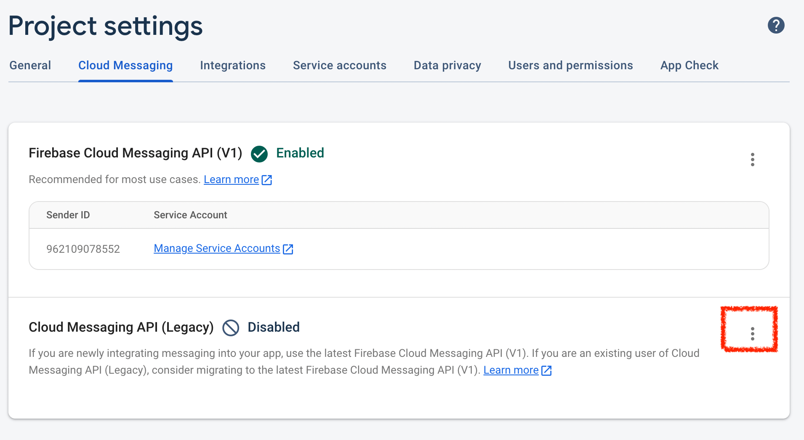<figcaption></figcaption></figure>

Enable the Cloud Messaging API (Legacy), Press the right side three dots Manage API in Google Cloud Console

Enable the Cloud Messaging API in Google Cloud Console

<figure><figcaption></figcaption></figure>

* Come back to Firebase Portal and reload the page, Then copy the Server Key\


<figure>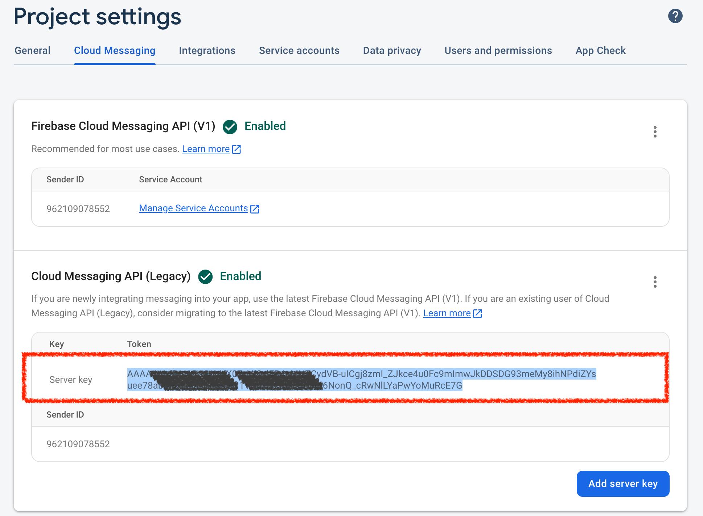<figcaption></figcaption></figure>

* Go your expo account -> Select the project -> Credentials -> Legacy (Classic Builds)

<figure><figcaption></figcaption></figure>

* Go FCM Server Key and Add a FCM Server Key

<figure><figcaption></figcaption></figure>

* Now paste the Server Key in Google Cloud Messaging Token and Save it

<figure><figcaption></figcaption></figure>

### 7.2 Copy Android SHA-1 To Firebase

\
Go to Expo Account -> Select The Project -> Credentials

<figure><figcaption></figcaption></figure>

<figure><figcaption></figcaption></figure>

Click on Application Identifiers

<figure>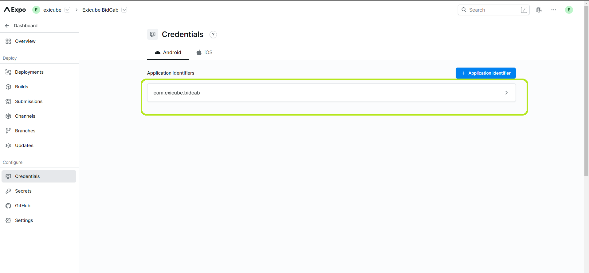<figcaption></figcaption></figure>

Copy the SHA-1 Certificate Fingerprint

<figure>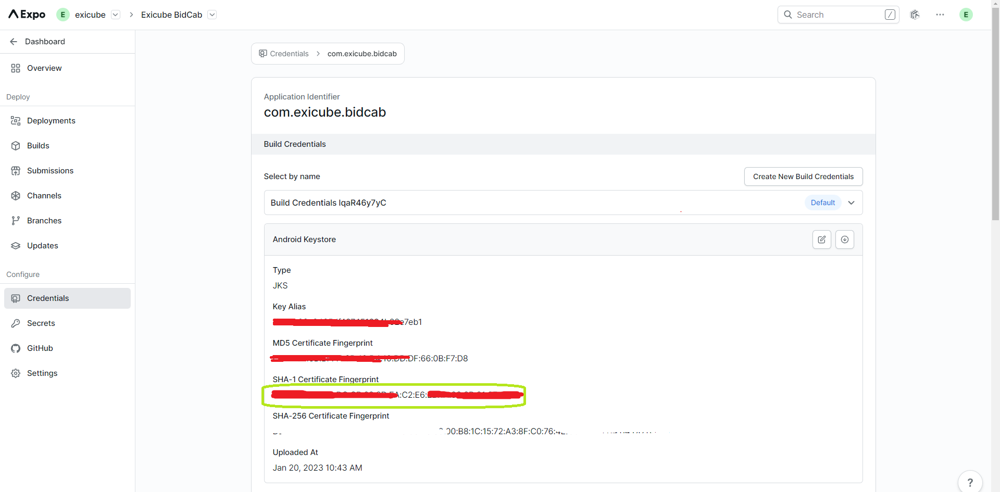<figcaption></figcaption></figure>

\
Go to your Firebase Portal -> Project Settings -> General -> Android apps -> Click on Add Fingerprint

<figure><figcaption></figcaption></figure>

Now paste the SHA-1 Certificate Fingerprint and Click on Save button


<figure><figcaption></figcaption></figure>

After Publish Your App in PlayStore Copy SHA-1 certificate fingerprint


<figure><figcaption></figcaption></figure>

And Paste It in your Firebase Portal -> Project Settings -> General -> Android apps -> Click on Add Fingerprint


<figure>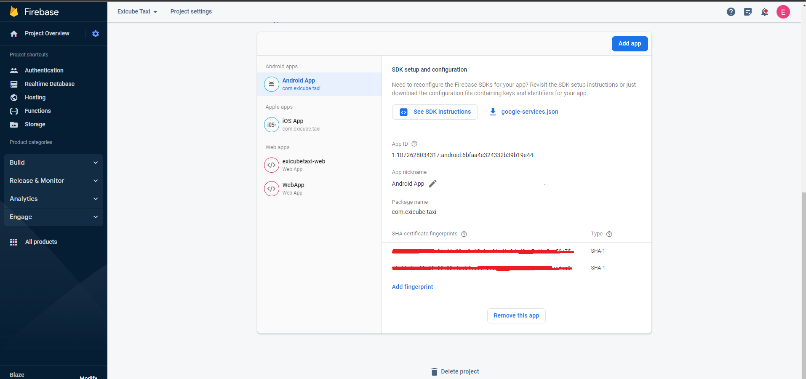<figcaption></figcaption></figure>

### 7.3 Upload Apple APNs to Firebase  Go to Expo Account -> Select The Project -> Credentials


<figure>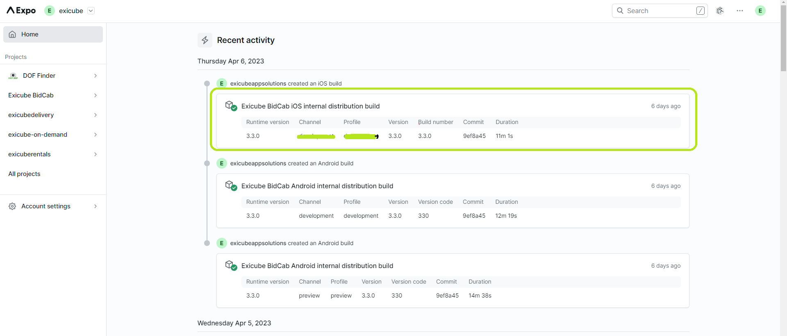<figcaption></figcaption></figure>

<figure>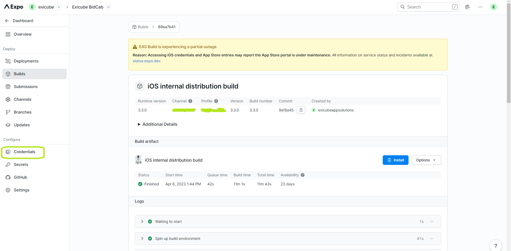<figcaption></figcaption></figure>

Click on Application Identifiers(IOS)

<figure><figcaption></figcaption></figure>

\
Go to Service Credentials > Push Key > Press Push Key Button and copy Key ID and Apple Team Identifier\


<figure>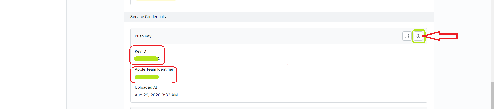<figcaption></figcaption></figure>

\
Go to Firebase Portal -> Project Settings -> Cloud Messaging -> Apple app configuration -> Upload the downloaded Push Key in APNs Authentication Key

*

    <figure>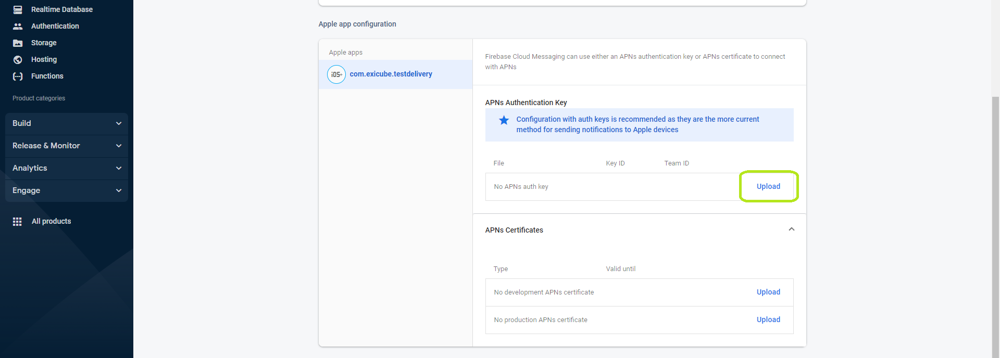<figcaption></figcaption></figure>

\
Browse the downloaded Push Key file and paste both Key ID and Apple Team Identifier Respectively


<figure>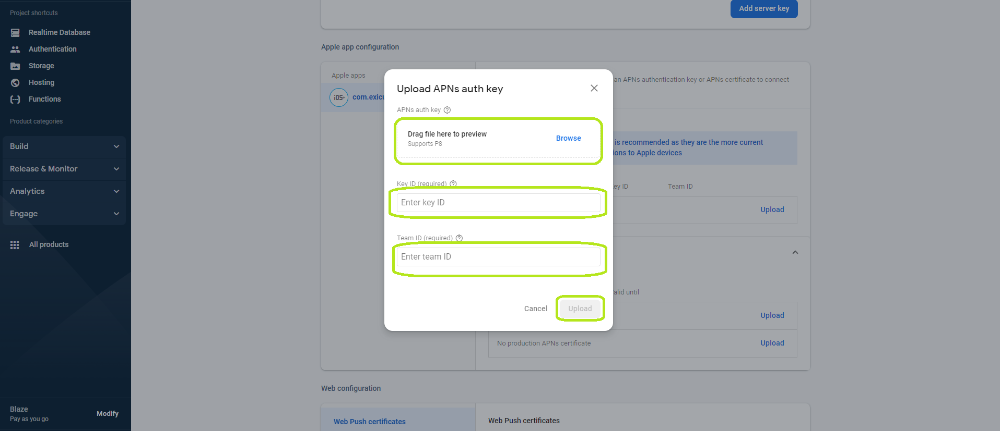<figcaption></figcaption></figure>

<figure>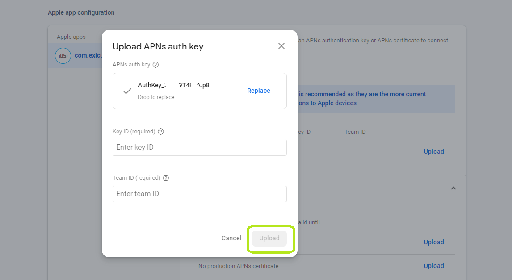<figcaption></figcaption></figure>

###


